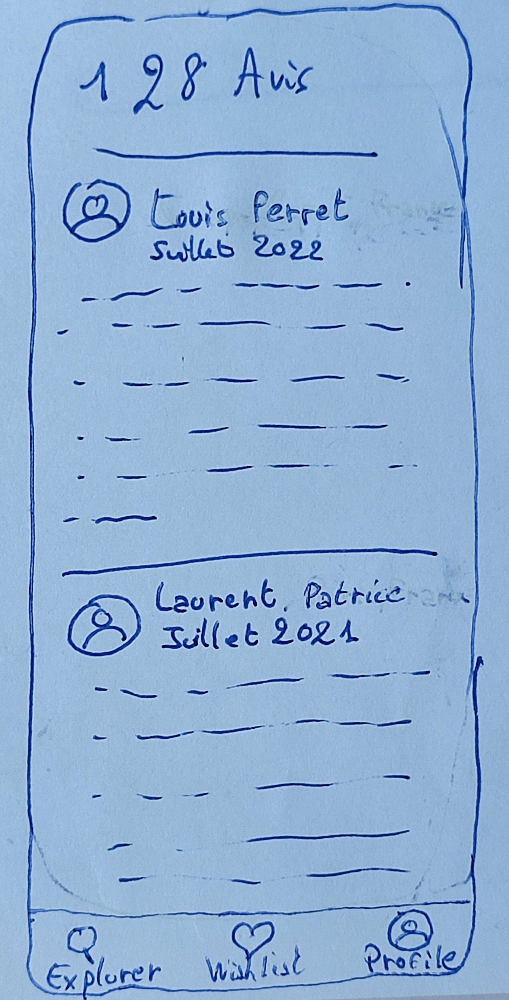

<h1 align="center">🏨 AirDB 🛌</h1>

The goal of AirDB is to propose a mobile application to allow a user to see various accommodations rented out by various users. The goal is to create an application similar to Airbnb.

## ✔️ Features

- [ ] Browse accommodation list get from a distant API. Accommodations can be added in the future and the app will only get better.
- [ ] Selection of accommodations and consultation of its information (name, description, location, images, host, dates, price...)
- [ ] Each profile of each user can be viewed to learn more information about it: reviews, rating, years hosting, identity, accommodations rented out by the user...
- [ ] Visualization of the different comments left for each user profile
- [ ] Writing comments and opinions on the different hosts
- [ ] Possibility to custome his own profile (name...)
- [ ] Possibility to add accommodations to a wishlist to consult them later.
- [ ] Support for landscape mode, multiple languages (English, French) and various themes (light / dark)

## 📱 Application

Here you can see the expected visual of the final application: 

    
    
    

    <i>
        In the final application, you will be able to iterates through the accommodations (figure 1), and see some information about them (figure 3). It will be possible to consult the profile of the host by clicking on its icon visible in the figure 2.
    </i>

    
    
    

    <i>
        You will also be able to see host information and some reviews about them. The accommodations that he ows can also be found on his profile screen. The profile tab redirects 
    </i>

## 🖥️ Langages and technologies used

- React Native ([API reference](https://reactnative.dev/))
- Springboot ([API reference](https://docs.spring.io/spring-boot/docs/current/api/))
- MongoDB [API reference](https://api.mongodb.com/)

## 🧵 Prerequisities

- [Visual Studio Code](https://code.visualstudio.com/)
- [NodeJS](https://nodejs.org/en): version > 12
- [npm](https://www.npmjs.com/) (or yarn)
- [expo-cli](https://expo.dev/) installed globally
- [mongodb](https://www.mongodb.com/)

## ⚙️ How to run the app ?

> To be added.

## 📌 Documentation

Some documentation can be found in the [Wiki]("https://codefirst.iut.uca.fr/git/jeremy.tremblay/AirDB/wiki") of this application.

Also, look at the `doc` folder at the root of this repository!

## 👤 Author

**TREMBLAY Jérémy**

* Github: [@JeremyTremblay2](https://github.com/JeremyTremblay2)
* LinkedIn: [@Jérémy Tremblay](https://fr.linkedin.com/in/j%C3%A9r%C3%A9my-tremblay2)

**PERRET Louis**

* Github: [@LouisPerret](https://github.com/louis-perret)
* LinkedIn: [@Louis Perret](https://fr.linkedin.com/in/louis-perret-a67a6321b)

## ⚠️ Disclaimer

This project in no way encourages the consumption of alcohol or beer, which is dangerous for your health and should be consumed in moderation.

## 📝 License

we want to leave the possibility to other people to work on this project, to improve it and to make it grow, that's why we decided to place it under MIT license.

> Read more about the [MIT licence](https://opensource.org/licenses/MIT).